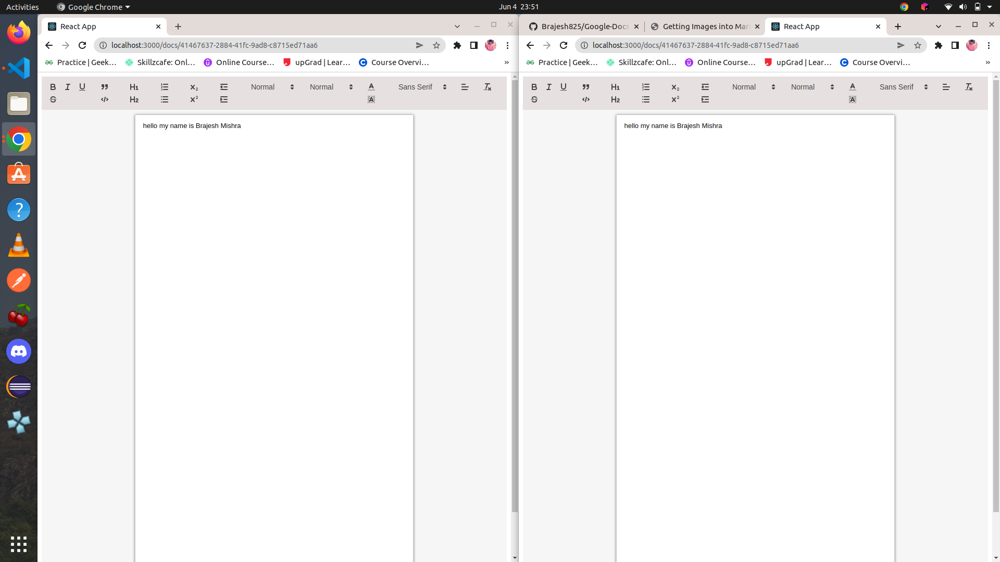

## Index

* [Features](#features)
* [Installation](#installation)
* [Environment Variables](#environment-variables)

## Features

* Real-time Collaboration
* insert photos
* Share document


## Installation

---
### Setup(Server):
---

>Install Node Modules
``` javascript
npm install
```

>Start the server
``` javascript
npm run start
```
---
### Setup(Client)):
---
>Install Node Modules
``` javascript
npm install
```

>Start the server
``` javascript
npm run start
```
---

## Environment Variables

``` javascript
MONGO_URI = (mongoose connection uri)
```
